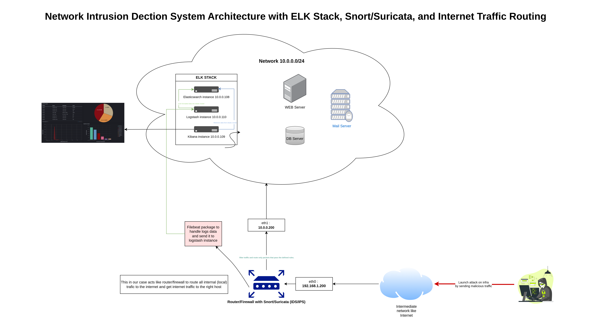
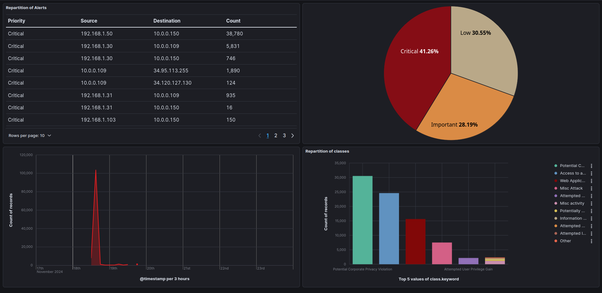
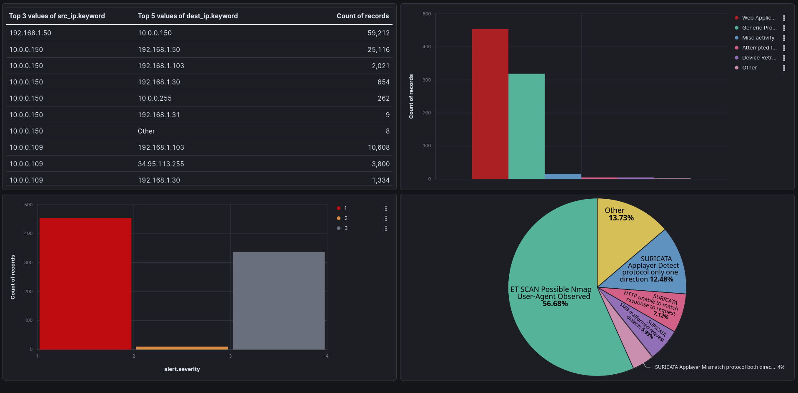

# Network Intrusion Detection System (NIDS)

## Overview

This repository contains the setup for a **Network Intrusion Detection System (NIDS)** using **Snort**, **Suricata**, and the **ELK stack**. The project involves configuring rules and alerts to monitor and respond to suspicious network activity. It also includes the setup of a **Metasploitable** machine inside Proxmox for penetration testing, designed to trigger detection rules and identify malicious activity.

## Screenshots

### Snort Dashboard

This is the Snort dashboard showing the real-time alerts and network activity. It provides insights into suspicious traffic detected by the Snort IDS, helping in immediate response and monitoring.

### Suricata Dashboard

The Suricata dashboard visualizes traffic and detected events. It provides a detailed overview of the network activity, including alerts, protocol analysis, and flow information. This dashboard aids in identifying potential threats across the network.
